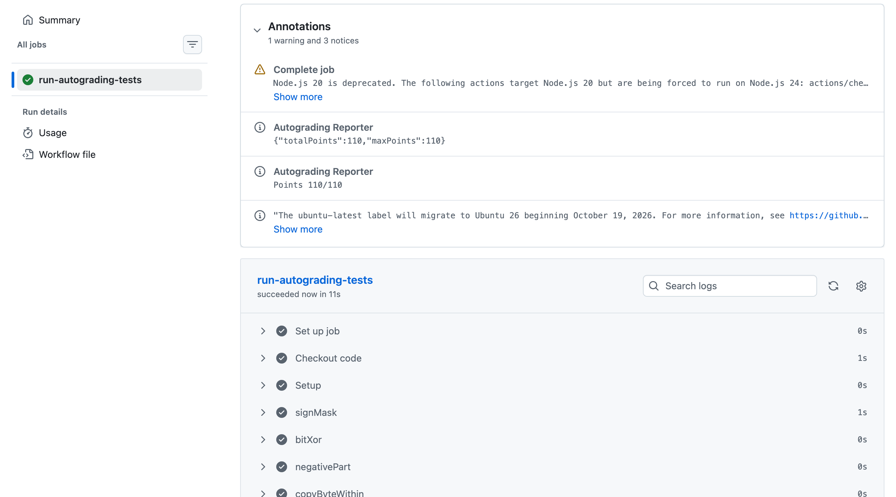
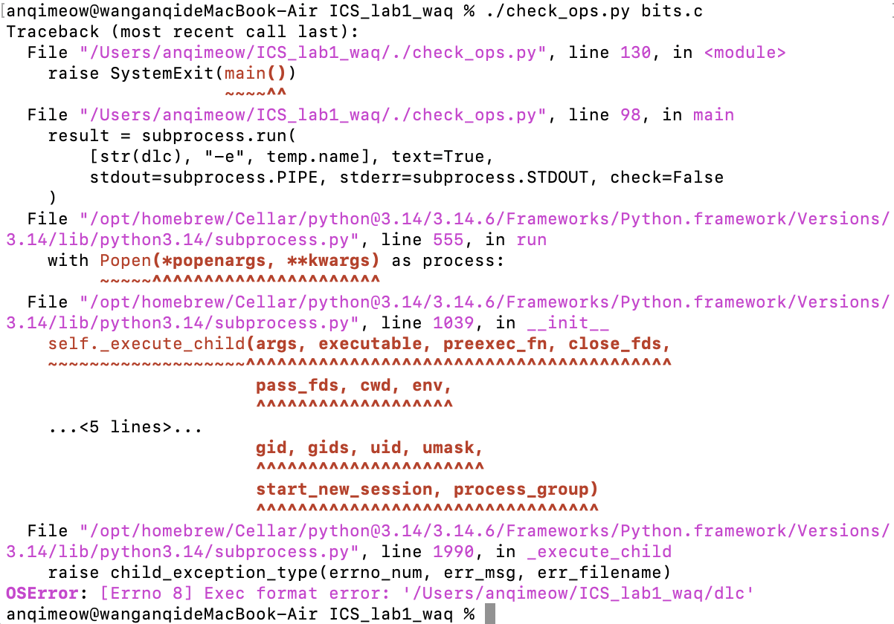
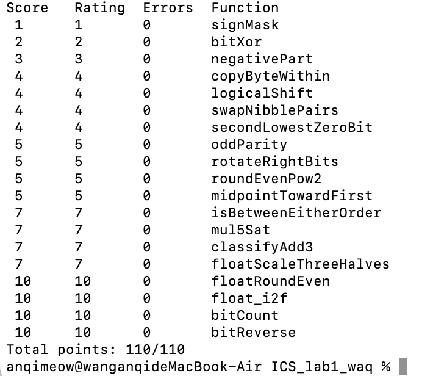

# Data Lab 实验报告

**姓名：** 王安琪  
**学号：** 25803050106  
**实验日期：** 2026 年 10 月 5 日

## 一、实验目的

通过受限的整数运算和 IEEE 754 单精度浮点数位级操作，理解补码、位掩码、移位、溢出检测、舍入规则及浮点数编码，并在指定操作符与操作数限制下实现相关函数。

## 二、实验环境与验证

本机为 Apple Silicon macOS。使用 `make all CFLAGS='-O -Wall -fwrapv'` 构建后，`./btest` 全部通过，得分为 **110/110**。仓库附带的 `dlc` 是 Linux ELF 可执行文件，因此本机执行 `./check_ops.py bits.c` 时遇到 `Exec format error`，无法在本机完成操作符检查。

### `./check_ops.py bits.c` 执行记录

本机执行后，检查器调用 Linux 版 `dlc` 时出现 `Exec format error`。这是 macOS arm64 与仓库中 Linux ELF 检查器不兼容导致的；最终规则检查由 GitHub Actions 在线完成。

### `./btest` 执行记录

本机 `./btest` 所有题目错误数均为 0，最终得分 **110/110**。

## 三、函数实现思路

### 整数题

- **P1 `signMask`：** 将 1 左移 31 位，构造仅最高位为 1 的掩码。
- **P2 `bitXor`：** 利用德摩根律，以 `~` 和 `&` 组合出异或：排除两个输入同为 0 或同为 1 的情形。
- **P3 `negativePart`：** 算术右移提取符号掩码；负数时通过取反加一求相反数，再由符号掩码筛选结果。
- **P4 `copyByteWithin`：** 将源、目标字节编号乘以 8 得到移位量；取出源字节、清除目标位置原字节，再写入新字节。
- **P5 `logicalShift`：** 先算术右移，再构造低 `32-n` 位为 1 的掩码清除符号扩展位。
- **P6 `swapNibblePairs`：** 用 `0x0f` 重复构造每字节低半字节掩码；分别提取高、低半字节并反向移位后合并。
- **P7 `secondLowestZeroBit`：** 对输入取反得到零位掩码；清除其中最低的 1，再隔离剩余最低的 1，即原数从低位起第二个零位。
- **P8 `oddParity`：** 通过异或折叠将各位的奇偶信息逐级汇总到最低位；按题意在 1 的个数为偶数时返回 1。
- **P9 `rotateRightBits`：** 将旋转量限制在 0–31；分别计算逻辑右移部分与补入高位的左移部分，再按位或合并。
- **P10 `roundEvenPow2`：** 分离商和余数，与半个步长比较；余数超过一半时进位，恰为一半时仅在商为奇数时进位，实现最近偶数舍入。
- **P11 `midpointTowardFirst`：** 用 `(x & y) + ((x ^ y) >> 1)` 求不溢出的向下取整中点；若和为奇数且第一个参数较大，则向上补 1，使结果靠近第一个参数。
- **P12 `isBetweenEitherOrder`：** 通过符号位区分异号比较和同号差值比较，构造端点与 `x` 的包含关系，再组合两个可能的端点顺序。最终将布尔结果限制为 0 或 1。
- **P13 `mul5Sat`：** 以移位和加法计算 `4x+x`；分别检测左移和加法引起的溢出，并用符号决定饱和值，再通过掩码选择普通结果或饱和值。
- **P14 `classifyAdd3`：** 连续执行两次加法，分别检测每次加法的正、负溢出；根据两次溢出的净方向，返回 1、-1 或 0。

### 浮点题

- **P15 `floatScaleThreeHalves`：** 分离符号、阶码和尾数；对非规格化数与规格化数分别构造有效数，计算乘以 3/2 的整数尾数并执行最近偶数舍入。处理尾数进位、阶码溢出、零、无穷和 NaN。
- **P16 `floatRoundEven`：** 从阶码确定二进制小数位数；对绝对值小于 1、指数较大的整数及一般舍入区间分别处理。通过余数与半单位比较并使用最低有效位处理平局，最后将舍入后的整数重新编码为浮点格式，同时保留负零和 NaN/无穷。
- **P17 `float_i2f`：** 取出符号并求整数绝对值，定位最高有效的 1 以确定阶码；将有效数对齐到尾数字段，丢弃位用于最近偶数舍入，并处理尾数舍入产生的阶码进位。

### 位计数与位反转

- **P18 `bitCount`：** 使用平行位计数法。依次以 1、2、4、8、16 位分组累加每组中 1 的数量。
- **P19 `bitReverse`：** 依次交换相邻位、2 位组、4 位组、字节和 16 位半字；掩码由不超过 `0xff` 的常量通过移位与异或构造。

## 四、实验体会

本实验让我更清楚地体会到，位级程序不能只验证常见输入。补码溢出、移位边界、半值舍入和符号零都可能让看似合理的实现产生错误。独立的结果测试与编码规则检查关注不同问题，二者都需要通过。首轮 GitHub Actions 得分为 96/110，指出 `isBetweenEitherOrder` 超出操作数上限、`mul5Sat` 使用了非法大常量；修改后线上评测达到 110/110，详见 [Autograding Reporter](https://github.com/Anqimeow/ICS_lab1_waq/actions/runs/37128076721/job/111217408969#annotation:23:241)。这让我认识到，正确性测试通过并不代表编码约束也合规。M 系列 Mac 无法直接运行课程附带的 Linux 检查器时，GitHub Actions 也提供了有效的远端验证途径。
